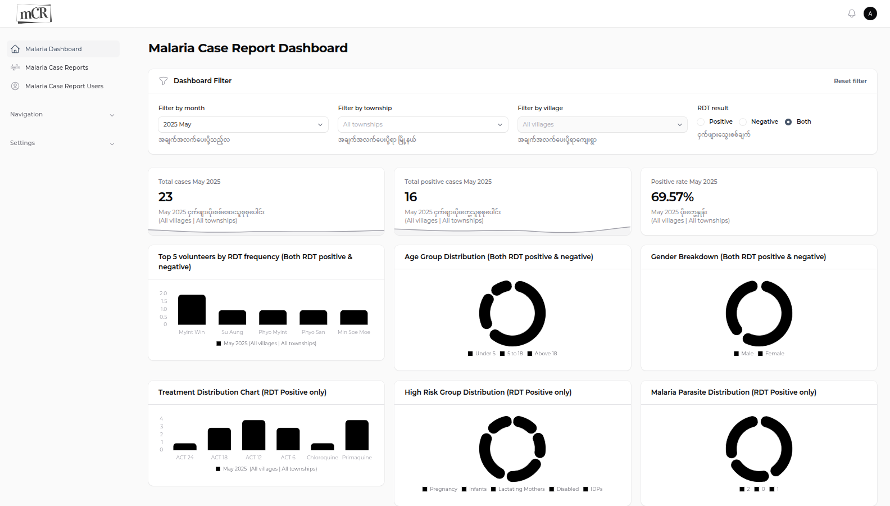

## Purpose of the application
ကျေးလက်ဒေသတွေ၊ ဝေးလံခေါင်ဖျားပြီး အင်တာနက်ဆက်သွယ်မှုခက်ခဲတဲ့ ဒေသတွေမှာ ငှက်ဖျားရောဂါစစ်ဆေးမှုမှတ်တမ်းတွေကို ရယူနိုင်ဖို့၊ အင်တာနက်ရတဲ့အချိန် ဗဟိုကိုပေးပို့နိုင်ဖို့နဲ့ ပေးပို့လာတဲ့ဒေတာတွေကို စီမံခန့်ခွဲနိုင်ဖို့ စနစ်တွေကိုယ်စီရှိကြပါတယ်။ ယခုဖော်ပြမယ့် web application ကတော့ ဗဟိုကိုရောက်ရှိလာတဲ့ ငှက်ဖျားစစ်ဆေးမှုအချက်အလက်တွေကို စီမံခန့်ခွဲနိုင်မှာဖြစ်ပါတယ်။
Web application ဟာ ဖုန်းနဲ့သုံးရတဲ့ mobile application မှာတုန်းကလို ငှက်ဖျားစစ်ဆေးမှုအချက်အလက်တွေ၊ ရောဂါလက္ခဏာတွေနဲ့ ငှက်ဖျားပိုးစစ်ဆေးတွေ့ရှိမှုတွေ မှတ်တမ်းတင်နိုင်တဲ့အပြင်
* ပေးထားတဲ့ဆေးတွေနဲ့ ကုသမှုအခြေအနေတွေကို စောင့်ကြည့်နိုင်ပါတယ်
* ဒေသအလိုက်၊ အသက်အရွယ်အလိုက်၊ ကျား/မအလိုက် ငှက်ဖျားဖြစ်ပွားမှုအခြေအနေတွေကို အလွယ်တကူသိရှိနိုင်ပါတယ်

ရောဂါအခြေအနေတွေကို အချိန်နဲ့တပြေးညီသိရှိနိုင်တာကြောင့် အရေးကြီးတဲ့ဆုံးဖြတ်ချက်တွေ ချမှတ်ရာမှာ၊ ငှက်ဖျားကာကွယ်ရေးလုပ်ငန်းတွေမှာ ပိုမိုထိရောက်စွာ ဆောင်ရွက်နိုင်မှာဖြစ်ပါတယ်။

## Overview of Features
အဓိကပါဝင်တဲ့လုပ်ငန်းတွေက

**Case registration**
- လူနာအသစ်များ အလွယ်တကူ မှတ်ပုံတင်နိုင်ခြင်း
- ကိုယ်ရေးအချက်အလက်များ (အမည်၊ အသက်၊ ကျား/မ၊ နေရပ်လိပ်စာ) ထည့်သွင်းနိုင်ခြင်း
- ရောဂါလက္ခဏာများနှင့် စစ်ဆေးတွေ့ရှိမှုမှတ်တမ်းများ ထိန်းသိမ်းနိုင်ခြင်း
- အန္တရာယ်ရှိအုပ်စုများ (ကိုယ်ဝန်ဆောင်၊ မွေးကင်းစကလေး၊ နို့တိုက်မိခင်) ခွဲခြားမှတ်တမ်းတင်နိုင်ခြင်း

**Management Information**
- ACT ဆေးဝါးအမျိုးမျိုး (ACT24, ACT18, ACT12, ACT6) ထည့်သွင်းနိုင်ခြင်း
- ကလိုရိုကွင်းနှင့် ပရိုင်မာကွင်းဆေး ပမာဏမှတ်တမ်းတင်နိုင်ခြင်း
- ဆေးရုံလွှဲပြောင်းမှုများ မှတ်တမ်းတင်နိုင်ခြင်း
- ကုသမှုဆိုင်ရာ အခြေအနေများ စောင့်ကြည့်နိုင်ခြင်း

**Search and Filter Information**
- မှတ်တမ်းများကို လအလိုက်၊ နှစ်အလိုက် ရှာဖွေနိုင်ခြင်း
- မြို့နယ်/ကျေးရွာအလိုက် စစ်ထုတ်ကြည့်ရှုနိုင်ခြင်း
- ကျား/မ၊ အသက်အုပ်စု၊ ရောဂါအမျိုးအစားအလိုက် မှတ်တမ်းများ စစ်ထုတ်နိုင်ခြင်း
- ဖော်ပြပုံအမျိုးမျိုးဖြင့် အချက်အလက်များကို ကြည့်ရှုနိုင်ခြင်း

**Dashboard analytics**
- အရေးကြီးကိန်းဂဏန်းများ အနှစ်ချုပ်ဖော်ပြခြင်း (StatsOverview)
- ကျား/မအချိုးဖော်ပြသည့် ပုံဂရပ်ဖ်
- အသက်အုပ်စုအလိုက် ဖြစ်ပွားမှုပုံဂရပ်ဖ်
- အန္တရာယ်ရှိအုပ်စုအလိုက် ဖြစ်ပွားမှုပုံဂရပ်ဖ်
- ငှက်ဖျားအမျိုးအစားအလိုက် ဖြစ်ပွားမှုပုံဂရပ်ဖ်
- ကုသမှုအမျိုးအစားအလိုက် အသုံးပြုမှုပုံဂရပ်ဖ်
- စေတနာ့ဝန်ထမ်းများ လွှမ်းခြုံနိုင်မှုဖော်ပြချက်
- အချိန်ကာလအလိုက် ဖြစ်ပွားမှုဆန်းစစ်ချက်များ

**Report format**
- CSV ဖိုင်သို့ ဒေတာထုတ်ယူနိုင်ခြင်း

**Data Management**
- ဒေတာသွင်းနိုင်ခြင်း
- ဒေတာထုတ်ယူနိုင်ခြင်း
- ဒေတာမှန်ကန်မှုစစ်ဆေးခြင်း

**Security**
- အသုံးပြုသူဝင်ရောက်မှုထိန်းချုပ်ခြင်း
- သီးသန့်အချက်အလက်များ ကာကွယ်ခြင်း
- အသုံးပြုသူအဆင့်အလိုက် လုပ်ပိုင်ခွင့်စီမံခြင်း
- စနစ်လုံခြုံရေးစီမံခန့်ခွဲခြင်း

## System Requirements
### Hardware
**Computer/ Laptop**

Windows 10 (သို့မဟုတ်) အထက်၊ macOS 10.13 (သို့မဟုတ်) အထက်၊ သို့မဟုတ် အခြား Linux စနစ်သုံး ကွန်ပျူတာ သို့မဟုတ် လက်ပ်တော့
- **Processor** - Intel Core i3 (သို့မဟုတ်) AMD ညီမျှသောပရိုဆက်ဆာ သို့မဟုတ် အထက်
- **RAM** - အနည်းဆုံး 4GB (8GB အထက်ရှိပါက ပိုမိုကောင်းမွန်)
- **Storage** - အနည်းဆုံး 256GB မှ 500GB SSD (သို့မဟုတ်) HDD
- **Display** - အနည်းဆုံး 1366 x 768 resolution display

### Software
- **Web browser** - Google Chrome 88 အထက်၊ Mozilla Firefox 78 အထက်၊ Microsoft Edge 88 အထက်၊ သို့မဟုတ် Safari 14 အထက်
- **Spreadsheet app** - ထုတ်ယူသည့်ဒေတာများဖွင့်ရန်အတွက် Microsoft Excel (သို့မဟုတ်) အလားတူ spreadsheet ပရိုဂရမ်

### Network requirements
- **အင်တာနက်** - အနည်းဆုံး 1Mbps အမြန်နှုန်းရှိပြီး လိုင်းငြိမ်ရမည်

### Security
- အချက်အလက်စီမံခန့်ခွဲရာ ကွန်ပြူတာတွင် အသုံးပြုသူ၏ စကားဝှက် (password) (သို့) လက်ဗွေစနစ်ဖြင့် ကာကွယ်ထားသင့်သည်
- အချက်အလက်ပျက်စီးဆုံးရှုံးမှုများမှ ကာကွယ်နိုင်ရန် ကွန်ပြူတာထဲတွင် antivirus software ထည့်သွင်းထားသင့်သည်

:::note
ယခုလိုအပ်ချက်များသည် Malaria Case Report Web application အတွက်ဖြစ်ပါသည်။ မိုဘိုင်းဖုန်း/တက်ဘလက်များတွင် အသုံးပြုနိုင်မည့် case report application မှာ အင်တာနက်မရှိသောဒေသများတွင် အချက်အလက်ကောက်ယူနိုင်မည်ဖြစ်ပြီး အင်တာနက်ရရှိသည့်အခါ ဗဟိုစနစ်သို့ပြန်လည်ပေးပို့နိုင်မည်ဖြစ်ပါသည်
:::
