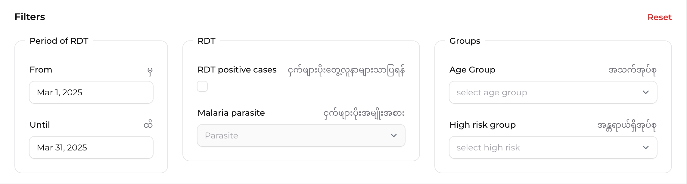

ဤစာမျက်နှာသည် malaria case report များကို စီမံခန့်ခွဲရန် အသုံးပြုသည့် စာမျက်နှာ ဖြစ်ပါသည်။ ဤစာမျက်နှာတွင် malaria case report အားလုံးကို စာရင်းပြုစုဖော်ပြထားပြီး ရှာဖွေခြင်း၊ စစ်ထုတ်ခြင်း၊ စာရင်းထုတ်ယူခြင်းတို့ ပြုလုပ်နိုင်ပါသည်။ စာမျက်နှာဘယ်ဘက်ရှိ navigation menu တွင် Malaria Case Reports ကိုနှိပ်၍ ယခုစာမျက်နှာကိုဖွင့်နိုင်ပါသည်။

### Add malaria case
စာမျက်နှာ၏ အပေါ်ဘက်ညာဘက်ထောင့်ရှိ "Add malaria case" ခလုတ်ကို နှိပ်၍ malaria case report အသစ်ကိုစာရင်းသွင်းနိုင်ပါသည်။ ဤခလုတ်ကို နှိပ်လိုက်ပါက ဒေတာသွင်းရန် ဖောင်တစ်ခု ပေါ်လာပါမည်။ အသေးစိတ်ကို [Adding new case reports](adding-new-case-reports) တွင်ဆက်လက်ဖတ်ရှုနိုင်ပါသည်။

### Download Excel
စာမျက်နှာ၏ အပေါ်ဘက်ညာဘက်တွင် "Download Excel" ခလုတ်ရှိပါသည်။ ဤခလုတ်ကို နှိပ်၍ လက်ရှိ filter လုပ်ထားသော malaria case report များကို Excel ဖိုင်အဖြစ် ထုတ်ယူနိုင်ပါသည်။

### Filters
"Filters" ခေါင်းစဉ်အောက်၌ malaria case report များကိုစစ်ထုတ်ကြည့်ရှု (filter) နိုင်မည့် အချက်များပါဝင်ပါသည်။

##### Period of RDT
RDT စမ်းသပ်စစ်ဆေးခဲ့သည့် ကာလကို ရွေးချယ်နိုင်ပါသည်။ From တွင် report စတင်လိုသည့်ရက်ကို ရွေးချယ်ပါ။ Until တွင် report ပြီးဆုံးလိုသည့်ရက်ကို ရွေးချယ်ပါ။

##### RDT
ငှက်ဖျားရောဂါ စစ်ဆေးမှုနှင့် ပတ်သက်သော filter များပါဝင်ပါသည်။ RDT positive cases ကိုအမှန်ခြစ်ရွေးချယ်ပြီး RDT positive case များကိုသာကြည့်ရှုနိုင်ပါသည်။ 

##### Malaria parasite
ငှက်ဖျားပိုးအမျိုးအစားအလိုက် စစ်ဆေးတွေ့ရှိသူများကို စစ်ထုတ်ကြည့်ရှုနိုင်ပါသည်။ "Parasite" ဆိုသည့်နေရာတွင် နှိပ်၍ အမျိုးအစားကို ရွေးချယ်ပါ။
:::note
ငှက်ဖျားပိုးတွေ့ (RDT Positive) ရလဒ်များကိုသာ ပိုးအမျိုးအစားစစ်ထုတ်ကြည့်ရှုနိုင်မည်ဖြစ်ပါသည်။ RDT positive cases ကိုအမှန်မခြစ်ထားပါက Malaria parasite ကိုရွေးချယ်ကြည့်ရှု၍မရနိုင်ပါ။
:::

##### Age Group
"select age group" ကိုနှိပ်၍ အသက်အုပ်စုအလိုက် စစ်ထုတ်နိုင်ပါသည်။ အသက် ၅ နှစ်အောက်၊ ၅ နှစ်မှ ၁၈ နှစ်၊ ၁၈ နှစ်အထက် ဟူ၍ရွေးချယ်ကြည့်ရှုနိုင်ပါသည်။

##### High risk group
"select high risk" ကို နှိပ်၍ ငှက်ဖျားပိုးစစ်ဆေးတွေ့ရှိလျှင် နောက်ဆက်တွဲအန္တရာယ်ရှိသည့် အုပ်စုများအလိုက် စစ်ထုတ်နိုင်ပါသည်။ ကိုယ်ဝန်ဆောင်မိခင်၊ အသက်တစ်နှစ်အောက်ကလေး၊ အသက်ခြောက်လအောက်ကလေးငယ်နို့်တိုက်မိခင်၊ မသန်စွမ်းသူ၊ စစ်ဘေးရှောင် စသည်ဖြင့်ရွေးချယ်နိုင်ပါသည်။

##### Reset
အပေါ်ညာဘက်ထောင့်ရှိ "Reset" ခလုတ်ကို နှိပ်၍ filter အားလုံးကိုနဂိုမူလသို့ပြန်ပြောင်းနိုင်ပါသည်။
:::note
Reset သည် filter ဖြင့်ရွေးချယ်ထားသည်များကို နဂိုမူလသို့ပြန်ပြောင်းခြင်းသာဖြစ်ပါသည်။ Reset နှိပ်မိခြင်းကြောင့် စနစ်အတွင်းရှိအချက်အလက်အားလုံး ပျောက်ပျက်သွားခြင်းမရှိပါ။
:::

##### Search
ဇယား၏ အပေါ်ပိုင်းညာဘက်ထောင့်တွင် "Search" ဟုရေးထားသော ရှာဖွေမှုအကွက်ရှိပါသည်။ ဤအကွက်တွင် အောက်ပါတန်ဖိုးများကို ရိုက်ထည့်၍ ရှာဖွေနိုင်ပါသည်။
* အချက်အလက်ပေးပို့သည့်လ (Reporting month)
* ငှက်ဖျားစစ်ဆေးမှုခံယူသူအမည် (Patient name)
* ငှက်ဖျားစေတနာ့ဝန်ထမ်း ကျေးရွာအမည် (Village name of malaria volunteer)
* အချက်အလက်ပေးပို့သူ၏ ကျေးရွာအမည် (Village name of reporting person)

### Data Table
စာမျက်နှာအောက်ပိုင်းတွင် Malaria case report အချက်အလက်ဇယား ရှိပါသည်။ ဇယားတွင် အောက်ပါကော်လံများ ပါဝင်ပါသည်

##### No.
ဇယားကွက်တွင်မှတ်တမ်းတစ်ခုချင်းစီအလိုက် နံပါတ်စဉ်ဖြစ်ပါသည်။

##### Reporting Month
Malaria case report အချက်အလက်ပေးပို့သည့်လကို ဖော်ပြထားပါသည် (နမူနာအားဖြင့် "January 2025")။
:::note
အချက်အလက်ပေးပို့သည့်လသည် ငှက်ဖျားစေတနာ့ဝန်ထမ်းထံမှဖြစ်စေ၊ အချက်အလက်ပေးပို့သူထံမှဖြစ်စေ ပေးပို့ရာတွင်စာရင်းသွင်းသည့်လဖြစ်ပါသည်။ ငှက်ဖျားစစ်ဆေးပြုလုပ်သည့်ရက်စွဲနှင့် အချက်အလက်ပေးပို့သည့်လ မတူညီသည့်မှတ်တမ်းများရှိနိုင်ပါသည်။
:::

##### RDT date
RDT စစ်ဆေးသည့်ရက်စွဲကို ဖော်ပြထားပါသည် (နမူနာအားဖြင့် "17-Jan-2025")။
:::note
RDT စစ်ဆေးသည့်ရက်စွဲနှင့် အချက်အလက်ပေးပို့သည့် reporting month တို့ မတူညီသည့်မှတ်တမ်းများရှိနိုင်ပါသည်
:::

##### Patient name
ငှက်ဖျားစစ်ဆေးမှုခံယူသူ အမည်ကို ဖော်ပြထားပါသည်။

##### Age
ငှက်ဖျားစစ်ဆေးမှုခံယူသူ၏ အသက်ကို ဖော်ပြထားပါသည် (နမူနာအားဖြင့် "10 months" သို့မဟုတ် "25 years")။

##### Gender
ငှက်ဖျားစစ်ဆေးမှုခံယူသူသည် အမျိုးသမီးဖြစ်ပါက ♀ သင်္ကေတဖြင့် ဖော်ပြပြီး အမျိုးသားဖြစ်ပါက ♂ သင်္ကေတဖြင့် ဖော်ပြထားပါသည်။ ကိုယ်ဝန်ဆောင်မိခင်ဖြစ်ပါက ကိုယ်ဝန်ဆောင် သင်္ကေတဖြင့်ဖော်ပြထားပါသည်

##### <6mth Lactating
၆ လအောက် ကလေးငယ်မိခင်(နို့တိုက်မိခင်) ဟုတ်မဟုတ် ဖော်ပြထားပါသည်။

##### RDT
RDT စစ်ဆေးမှုရလဒ်ကို ဖော်ပြထားပါသည်။ RDT Positive ရလဒ်များကို အနီရောင် (+) သင်္ကေတနှင့်ပြသထားပြီး RDT Negative ရလဒ်များကို အစိမ်းရောင် (-) သင်္ကေတနှင့်ပြသထားပါသည်။

##### M.P
ငှက်ဖျားပိုးအမျိုးအစားကို ဖော်ပြထားပါသည် (နမူနာအားဖြင့် "Pf" (Plasmodium falciparum) သို့မဟုတ် "Pv" (Plasmodium vivax))။

##### Volunteer
စေတနာ့ဝန်ထမ်း၏ အမည်နှင့် ကျေးရွာ၊ မြို့နယ်အမည်တွဲလျက်ဖော်ပြထားပါသည်။

##### Edit
ဇယား၏ ညာဘက်ဆုံးတွင် "Edit" ခလုတ်ရှိပါသည်။ ဤခလုတ်ကို နှိပ်၍ သက်ဆိုင်ရာ malaria case report အချက်အလက်များကို ပြင်ဆင်နိုင်ပါသည်။ အသေးစိတ်ကို [Editing malaria case report](editing-case-reports) တွင်ဆက်လက်ဖတ်ရှုနိုင်ပါသည်။

##### View
ဇယားတွင်းရှိ မှတ်တမ်းတစ်ခုချင်းစီကို mouse click နှိပ်ပြီး အသေးစိတ်ကြည့်ရှုနိုင်မည့်စာမျက်နှာသို့ သွားရောက်နိုင်ပါသည်။ [Viewing malaria case report](viewing-case-reports) တွင်ဆက်လက်ဖတ်ရှုနိုင်ပါသည်။

##### Data Selection
မှတ်တမ်းတခုချင်းစီ၏ ဘယ်ဘက်တွင် အမှန်ခြစ်ကွက်လေးများရှိပါသည်။ ဤအမှန်ခြစ်လေးများကို ရွေးချယ်၍ malaria case report များကို တစုတစည်းတည်း select လုပ်ရွေးယူနိုင်ပါသည်။

##### Pagination
စာမျက်နှာ၏ အောက်ဆုံးတွင် ဇယားကွက်စာမျက်နှာ နံပါတ်များ ပေါ်လာပါမည်။ ဤနံပါတ်များကို နှိပ်၍ နောက်စာမျက်နှာများသို့ သွားနိုင်ပါသည်။

