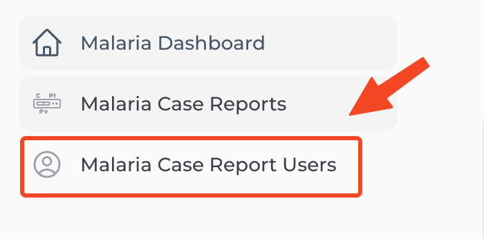
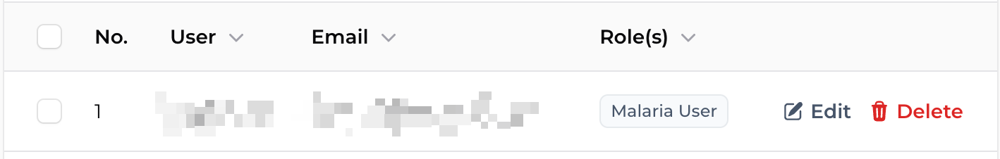
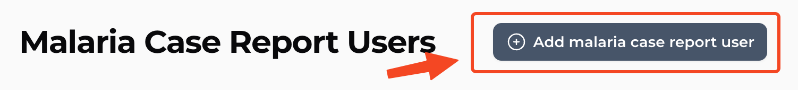

Malaria Case Report web application အသုံးပြုဖို့ user ဖန်တီးခြင်းအဆင့်ဆင့်ကိုဖော်ပြထားပါသည်။ ယခုစာမျက်နှာတွင် ဖော်ပြသည့်အကြောင်းအရာများသည် malaria case report web application အသုံးပြုရန် user account များဖန်တိးခြင်းဖြစ်ပါသည်။ mobile application အသုံးပြုမည့် user များနှင့်မသက်ဆိုင်ပါ။ Malaria admin role ရရှိထားသူများသာ ယခုစာမျက်နှာကိုမြင်တွေ့နိုင်ပါသည်

## Accessing User Management

Malaria Case Report အသုံးပြုသူများကို စီမံခန့်ခွဲရန် ဘယ်ဘက်ရှိ Navigation Bar တွင် "Malaria Case Report Users" ကိုနှိပ်ပါ။

## User Management Overview

User management စာမျက်နှာတွင် Malaria Case Report အသုံးပြုသူများစာရင်းကို ဇယားဖြင့်မြင်တွေ့ရပါမည်။

1. **Number**
2. **User** - အသုံးပြုသူ၏ အမည်
3. **Email** - အသုံးပြုသူ၏ အီးမေးလ်လိပ်စာ
4. **Role(s)** - အသုံးပြုသူ၏ တာဝန် (Malaria Admin သို့မဟုတ် Malaria User)

:::note
Malaria case report admin account ရှိသူများသာ Malaria case report user များစီမံခန့်ခွဲနိုင်ပါသည်။ ထို့ကြောင့် user အသစ်များထည့်သွင်းလိုပါက Malaria User တစ်မျိုးတည်းသာရွေးချယ်ပါ။ အခြား system user များအတွက် user ဖန်တီးခြင်းကို သက်ဆိုင်ရာ system user setting များတွင်သာပြုလုပ်နိုင်ပါသည်။
:::

## Creating a New User

Malaria Case Report စနစ်အတွက် အသုံးပြုသူအသစ်တစ်ဦး ဖန်တီးရန်

1. User management စာမျက်နှာအထက် ညာဘက်ထောင့်ရှိ "Add malaria case report user" ခလုတ်ကိုနှိပ်ပါ။
2. အောက်ပါအချက်အလက်များကို ဖြည့်သွင်းရပါမည်။

### User Name and Email

#### Username
အသုံးပြုသူ၏ အမည်ကို ဖြည့်သွင်းရန်ဖြစ်ပါသည်။

:::tip
Username ကို မှတ်ရလွယ်ကူပြီး အသုံးပြုသူနှင့် သက်ဆိုင်သည့်အမည်ကို ရွေးချယ်ပေးသင့်ပါသည်။ ဥပမာ - မြို့နယ်အမည်နှင့်တွဲ၍ ပေးခြင်း
:::

#### Email
အသုံးပြုသူသုံးမည့် အီးမေးလ်လိပ်စာကို ဖြည့်သွင်းရန်ဖြစ်ပါသည်။

:::caution
Information Portal တစ်ခုလုံးတွင် Email လိပ်စာတစ်ခုကို account တစ်ခုသာဖွင့်ခွင့်ရှိပါသည်။ Information portal အောက်ရှိ system တစ်ခုတွင် account ဖွင့်ထားသည့် အီးမေးလ်လိပ်စာကို ထပ်မံအသုံးပြု၍မရပါ။ Email လိပ်စာတစ်ခုလျှင် system တစ်ခုထက်ပိုအသုံးပြုလိုပါက နောက်တွင်ဆက်လက်ဖော်ပြမည့် user role များသတ်မှတ်ပေးနိုင်ပါသည်။
:::

#### Roles
အသုံးပြုသူ၏ တာဝန်ကိုရွေးချယ်ရန်ဖြစ်ပါသည်။

- **Malaria User** - ငှက်ဖျားလူနာမှတ်တမ်းများကို ဖြည့်သွင်းခြင်း၊ ကြည့်ရှုခြင်း လုပ်ခွင့်ရှိသူ
- **Malaria Admin** - Malaria User ၏ လုပ်ပိုင်ခွင့်အားလုံးအပြင် အသုံးပြုသူအကောင့်များ စီမံခန့်ခွဲခွင့်ရှိသူ

:::caution
Malaria Admin တာဝန်သည် စနစ်တွင် ပြင်ဆင်ခြင်း၊ ဖျက်ခြင်းကဲ့သို့ အရေးပါသော လုပ်ပိုင်ခွင့်များပါဝင်သဖြင့် လက်တွေ့လိုအပ်သူများကိုသာ ဤတာဝန်ပေးသင့်ပါသည်။ အခြားသူများကို Malaria User အဖြစ်သာ သတ်မှတ်သင့်ပါသည်။
:::

### Password

#### Password
အသုံးပြုသူ၏ စကားဝှက်ကို ဖြည့်သွင်းရန်ဖြစ်ပါသည်။

:::info
စကားဝှက်သည် အနည်းဆုံး စာလုံး၈လုံးပါဝင်ရမည်ဖြစ်ပြီး လုံခြုံရေးစံနှုန်းများနှင့်ကိုက်ညီရပါမည်။ စကားဝှက်ကို Hide/Show ခလုတ်ဖြင့် မြင်နိုင်/မမြင်နိုင်အောင် ပြောင်းလဲကြည့်ရှုနိုင်ပါသည်။
:::

#### Confirm Password
အထက်တွင်ဖြည့်သွင်းခဲ့သော စကားဝှက်ကို ပြန်လည်အတည်ပြုရန် ဖြည့်သွင်းရပါမည်။

:::caution
စကားဝှက်နှင့် အတည်ပြုစကားဝှက်တို့သည် တူညီရမည်ဖြစ်ပါသည်။ မတူညီပါက "Password confirmation doesn't match" ဟူသော အမှားပေါ်လာမည်ဖြစ်ပါသည်။
:::

### Profile Information

#### Position
အသုံးပြုသူ၏ ရာထူးအဆင့်ကို ဖြည့်သွင်းရန်ဖြစ်ပါသည်။

:::note
ဤအကွက်သည် အသုံးပြုသူအကောင့် ပြင်ဆင်ချိန်တွင် မဖြစ်မနေဖြည့်သွင်းရမည့် အကွက်ဖြစ်ပါသည်။ အသုံးပြုသူ ဖန်တီးသည့်အချိန်တွင် ချန်လှပ်ထားနိုင်ပါသည်။
:::

#### Country Code & Phone
အသုံးပြုသူ၏ ဖုန်းနံပါတ်အတွက် နိုင်ငံကုဒ်နှင့် ဖုန်းနံပါတ်ကို ဖြည့်သွင်းရန်ဖြစ်ပါသည်။ နိုင်ငံကုဒ်အနေဖြင့် Thailand (+66) သို့မဟုတ် Myanmar (+95) ကို ရွေးချယ်နိုင်ပါသည်။

:::tip
ဖုန်းနံပါတ်ကို ဖြည့်သွင်းရာတွင် နိုင်ငံကုဒ်ကို ပြန်လည်ရိုက်ထည့်ရန်မလိုပါ။ Country code နေရာတွင် ရွေးချယ်ထားသော နိုင်ငံကုဒ်ကို phone နံပါတ်ရှေ့တွင် အလိုအလျောက်ဖော်ပြပေးမည်ဖြစ်ပါသည်။
:::

#### Avatar Upload
အသုံးပြုသူ၏ ပရိုဖိုင်ဓာတ်ပုံကို တင်လိုပါက ဤနေရာတွင် ဓာတ်ပုံဖိုင်ကို upload လုပ်နိုင်ပါသည်။

## Saving a New User

အချက်အလက်များဖြည့်သွင်းပြီးပါက စာမျက်နှာအောက်ခြေရှိ "Create" ခလုတ်ကိုနှိပ်၍ အသုံးပြုသူအသစ်ကို ဖန်တီးနိုင်ပါသည်။

အောင်မြင်စွာ ဖန်တီးပြီးပါက "Malaria Case Report User successfully created" ဟူသည့် မက်ဆေ့ချ်ကို မြင်ရမည်ဖြစ်ပြီး User management စာမျက်နှာသို့ ပြန်လည်ရောက်ရှိမည်ဖြစ်ပါသည်။ လက်ရှိ account ကို Log out ပြန်ထွက်ပြီး အသစ်ဖန်တီီးလိုက်သည့် user account ကိုအသုံးပြု၍ Login ဆက်လက်ဝင်ရောက်အသုံးပြုနိုင်ပါသည်။

## Editing Existing Users

ရှိပြီးသားအသုံးပြုသူတစ်ဦး၏ အချက်အလက်များကို ပြင်ဆင်လိုပါက ဇယားတွင် အဆိုပါအသုံးပြုသူ record ညာဘက်အစွန်ရှိ Edit icon ကိုနှိပ်ပါ။

:::info
User edit လုပ်သည့်အချိန်တွင် Password များကို မဖြစ်မနေအစမှပြန်ရိုက်ရန်မလိုဘဲ ချန်ထားခဲ့နိုင်ပါသည်။ password ပြင်ဆင်လိုမှသာ ဖြည့်သွင်းရန်ဖြစ်ပါသည်။
:::

အချက်အလက်များပြင်ဆင်ပြီးပါက စာမျက်နှာအောက်ခြေရှိ "Save changes" ခလုတ်ကိုနှိပ်၍ သိမ်းဆည်းနိုင်ပါသည်။

"Malaria Case Report User successfully updated" ဟူသည့် အောင်မြင်ကြောင်းမက်ဆေ့ချ်ကို မြင်ရမည်ဖြစ်ပြီး User management စာမျက်နှာသို့ ပြန်လည်ရောက်ရှိမည်ဖြစ်ပါသည်။

## Deleting Users

အသုံးပြုသူတစ်ဦးကို ဖျက်လိုပါက ဇယားကွက်တွင် သက်ဆိုင်ရာ user record ကွက်ညာဘက်အစွန်ရှိ Delete ခလုတ်ကိုနှိပ်ပါ။

:::caution
User တစ်ဦးကိုဖျက်လိုက်လျှင် ၎င်းနှင့်ဆိုင်သည့်အချက်အလက်များ ပြန်မရနိုင်တော့သောကြောင့် မဖျက်ခင်သေချာစွာဂရုစိုက်ရန်လိုပါသည်။
:::